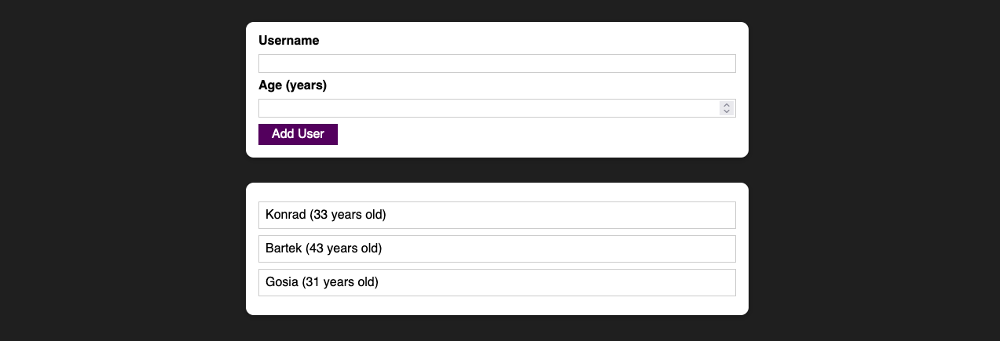
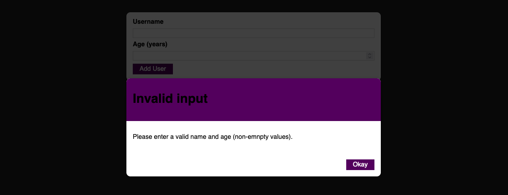

# Users

This is a simple React app for adding users to a list using a modal. The modal will inform the user if any required fields are not filled in or if the age specified is incorrect.

## Demo

You can try the app live at: https://user-pan-be.netlify.app/

## How to use

To use the app, simply click on the "Add User" button to open the modal. Fill in the required fields (name, age, email) and click "Add" to add the user to the list.

## Technologies used

    React
    CSS
    Netlify (for deployment)

## Author

This app was created by [Pan.Be](https://pan-be.vercel.app/). Feel free to contact me with any questions or feedback.
